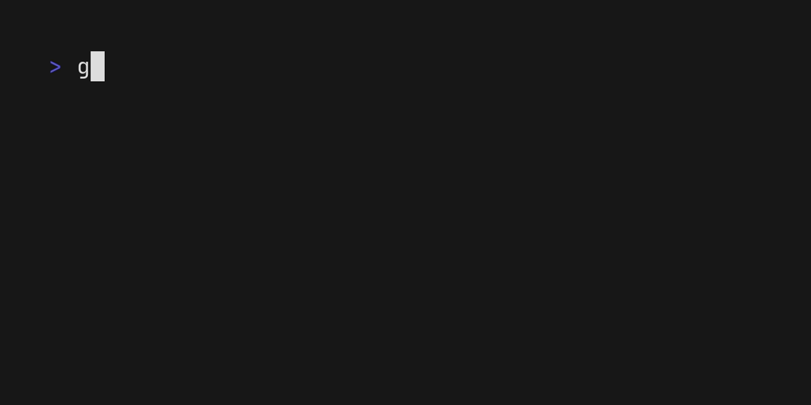

# go-fzf

[](https://pkg.go.dev/github.com/koki-develop/go-fzf)
[](https://github.com/koki-develop/go-fzf/releases/latest)
[](https://github.com/koki-develop/go-fzf/actions/workflows/ci.yml)
[](https://codeclimate.com/github/koki-develop/go-fzf/maintainability)
[](https://goreportcard.com/report/github.com/koki-develop/go-fzf)
[](./LICENSE)

Fuzzy Finder CLI and Library.

- [使い方](#使い方)
  - [CLI](#cli-として使用する)
  - [ライブラリ](#ライブラリとして使用する)
- [ライセンス](#ライセンス)

## 使い方

### CLI として使用する

go-fzf で何ができるのかを知りたい場合は `gofzf` CLI を試してください。  
`gofzf` CLI は go-fzf で作られており、 go-fzf のほとんどの機能を利用可能です。


詳しい情報は[ドキュメント](./docs/cli/README.md)をご参照ください。

### ライブラリとして使用する

go-fzf を使用するとカスタマイズ性の高い Fuzzy Finder を簡単に作ることができます。  
例えば、たったこれだけのコードで以下のような Fuzzy Finder を作ることができます。

```go
package main

import (
	"fmt"
	"log"

	"github.com/koki-develop/go-fzf"
)

func main() {
	items := []string{"hello", "world", "foo", "bar"}

	f, _ := fzf.New()
	if err != nil {
		log.Fatal(err)
	}

	idxs, err := f.Find(items, func(i int) string { return items[i] })
	if err != nil {
		log.Fatal(err)
	}

	for _, i := range idxs {
		fmt.Println(items[i])
	}
}
```



詳しい情報は[ドキュメント](./docs/library/README.md)をご参照ください。  
また、 [examples](./examples/) には go-fzf の使い方の様々なサンプルが用意されています。

## ライセンス

[MIT](./LICENSE)
