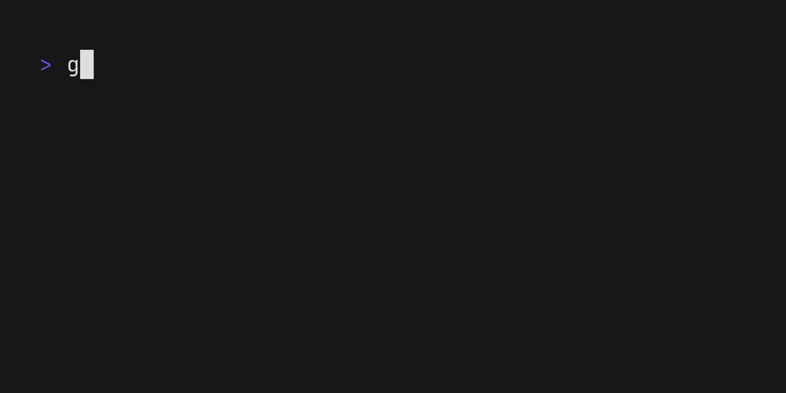

<h1 align="center">🔍 go-fzf</h1>

<p align="center">
<a href="https://pkg.go.dev/github.com/koki-develop/go-fzf"></a>
<a href="https://github.com/koki-develop/go-fzf/releases/latest"></a>
<a href="https://github.com/koki-develop/go-fzf/actions/workflows/ci.yml"></a>
<a href="https://codeclimate.com/github/koki-develop/go-fzf/maintainability"></a>
<a href="https://goreportcard.com/report/github.com/koki-develop/go-fzf"></a>
<a href="./LICENSE"></a>
</p>

<p align="center">
Fuzzy Finder CLI and Library.
</p>

<p align="center">
English | <a href="./README.ja.md">日本語</a>
</p>

## Contents

- [Usage](#usage)
  - [CLI](#using-as-a-cli)
  - [Library](#using-as-a-library)
- [LICENSE](#license)

## Usage

### Using as a CLI

If you want to know what you can do with go-fzf, try the `gofzf` CLI.  
The `gofzf` CLI is built with go-fzf and can utilize most of go-fzf's features.


For more information, please refer to the [documentation](./docs/cli/README.md).

### Using as a library

With go-fzf, you can easily create a highly customizable Fuzzy Finder.  
For example, you can create a Fuzzy Finder like the one below with just this simple code:

```go
package main

import (
	"fmt"
	"log"

	"github.com/koki-develop/go-fzf"
)

func main() {
	items := []string{"hello", "world", "foo", "bar"}

	f, _ := fzf.New()
	if err != nil {
		log.Fatal(err)
	}

	idxs, err := f.Find(items, func(i int) string { return items[i] })
	if err != nil {
		log.Fatal(err)
	}

	for _, i := range idxs {
		fmt.Println(items[i])
	}
}
```



For more information, please refer to the [documentation](./docs/library/README.md)

#### Examples

Various examples of how to use go-fzf are available in the [examples](./examples/) directory.

## LICENSE

[MIT](./LICENSE)
