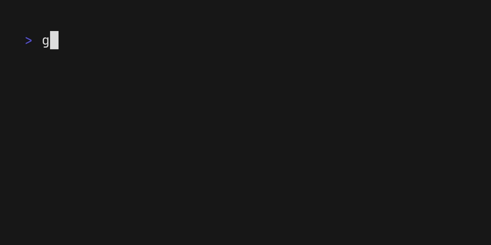

# CLI として使う

## 目次

- [インストール](#インストール)
- [使い方](#使い方)
  - [基本](#基本)
  - [複数選択](#複数選択)
  - [UI をカスタマイズする](#ui-をカスタマイズする)

## インストール

### Homebrew

```console
$ brew install koki-develop/tap/gofzf
```

### `go install`

```console
$ go install github.com/koki-develop/go-fzf/cmd/gofzf@latest
```

### Releases

[リリースページ](https://github.com/koki-develop/go-fzf/releases/latest)から直接バイナリをダウンロードしてください。

## 使い方

### 基本

`gofzf` をそのまま実行すると、作業ディレクトリから再帰的にファイルをあいまい検索します。



検索対象のアイテムを標準入力から改行区切りで渡すこともできます。


### 複数選択

`--limit` フラグで選択可能なアイテムの数を設定できます。  
アイテムは Tab キーで選択できます。


`--no-limit` フラグを設定するとアイテムを無制限に選択できるようになります。


### UI をカスタマイズする

`gofzf` CLI はフラグを使用して様々な見た目のカスタマイズができます。

- [プロンプト](#プロンプト)
- [インプットのプレースホルダ](#インプットのプレースホルダ)
- [インプットのテキスト](#インプットのテキスト)
- [カーソル](#カーソル)
- [カーソル行](#カーソル行)
- [選択中 / 未選択アイテムの接頭辞](#選択中--未選択アイテムの接頭辞)
- [一致文字](#一致文字)

#### プロンプト

| フラグ               | デフォルト | 説明                             |
| -------------------- | ---------- | -------------------------------- |
| `--prompt`           | `"> "`     | プロンプトの文字列。             |
| `--prompt-fg`        | N/A        | プロンプトの文字色。             |
| `--prompt-bg`        | N/A        | プロンプトの背景色。             |
| `--prompt-bold`      | `false`    | プロンプトを太字にする。         |
| `--prompt-blink`     | `false`    | プロンプトを点滅させる。         |
| `--prompt-italic`    | `false`    | プロンプトをイタリック体にする。 |
| `--prompt-strike`    | `false`    | プロンプトに取り消し線を引く。   |
| `--prompt-underline` | `false`    | プロンプトに下線を引く。         |
| `--prompt-faint`     | `false`    | プロンプトを薄く表示する。       |

#### インプットのプレースホルダ

| フラグ                          | デフォルト    | 説明                                             |
| ------------------------------- | ------------- | ------------------------------------------------ |
| `--input-placeholder`           | `"Filter..."` | インプットのプレースホルダ。                     |
| `--input-placeholder-fg`        | N/A           | インプットのプレースホルダの文字色。             |
| `--input-placeholder-bg`        | N/A           | インプットのプレースホルダの背景色。             |
| `--input-placeholder-bold`      | `false`       | インプットのプレースホルダを太字にする。         |
| `--input-placeholder-blink`     | `false`       | インプットのプレースホルダを点滅させる。         |
| `--input-placeholder-italic`    | `false`       | インプットのプレースホルダをイタリック体にする。 |
| `--input-placeholder-strike`    | `false`       | インプットのプレースホルダに取り消し線を引く。   |
| `--input-placeholder-underline` | `false`       | インプットのプレースホルダに下線を引く。         |
| `--input-placeholder-faint`     | `true`        | インプットのプレースホルダを薄く表示する。       |

#### インプットのテキスト

| フラグ                          | デフォルト | 説明                                       |
| ------------------------------- | ---------- | ------------------------------------------ |
| `--input-placeholder-fg`        | N/A        | インプットのテキストの文字色。             |
| `--input-placeholder-bg`        | N/A        | インプットのテキストの背景色。             |
| `--input-placeholder-bold`      | `false`    | インプットのテキストを太字にする。         |
| `--input-placeholder-blink`     | `false`    | インプットのテキストを点滅させる。         |
| `--input-placeholder-italic`    | `false`    | インプットのテキストをイタリック体にする。 |
| `--input-placeholder-strike`    | `false`    | インプットのテキストに取り消し線を引く。   |
| `--input-placeholder-underline` | `false`    | インプットのテキストに下線を引く。         |
| `--input-placeholder-faint`     | `false`    | インプットのテキストを薄く表示する。       |

#### カーソル

| フラグ               | デフォルト  | 説明                           |
| -------------------- | ----------- | ------------------------------ |
| `--cursor`           | `"> "`      | カーソルの文字列。             |
| `--cursor-fg`        | `"#00ADD8"` | カーソルの文字色。             |
| `--cursor-bg`        | N/A         | カーソルの背景色。             |
| `--cursor-bold`      | `false`     | カーソルを太字にする。         |
| `--cursor-blink`     | `false`     | カーソルを点滅させる。         |
| `--cursor-italic`    | `false`     | カーソルをイタリック体にする。 |
| `--cursor-strike`    | `false`     | カーソルに取り消し線を引く。   |
| `--cursor-underline` | `false`     | カーソルに下線を引く。         |
| `--cursor-faint`     | `false`     | カーソルを薄く表示する。       |

#### カーソル行

| フラグ                   | デフォルト | 説明                             |
| ------------------------ | ---------- | -------------------------------- |
| `--cursorline-fg`        | N/A        | カーソル行の文字色。             |
| `--cursorline-bg`        | N/A        | カーソル行の背景色。             |
| `--cursorline-bold`      | `true`     | カーソル行を太字にする。         |
| `--cursorline-blink`     | `false`    | カーソル行を点滅させる。         |
| `--cursorline-italic`    | `false`    | カーソル行をイタリック体にする。 |
| `--cursorline-strike`    | `false`    | カーソル行に取り消し線を引く。   |
| `--cursorline-underline` | `false`    | カーソル行に下線を引く。         |
| `--cursorline-faint`     | `false`    | カーソル行を薄く表示する。       |

#### 選択中 / 未選択アイテムの接頭辞

| フラグ                        | デフォルト  | 説明                                         |
| ----------------------------- | ----------- | -------------------------------------------- |
| `--selected-prefix`           | `"●"`       | 選択中アイテムの接頭辞。                     |
| `--selected-prefix-fg`        | `"#00ADD8"` | 選択中アイテムの接頭辞の文字色。             |
| `--selected-prefix-bg`        | N/A         | 選択中アイテムの接頭辞の背景色。             |
| `--selected-prefix-bold`      | `false`     | 選択中アイテムの接頭辞を太字にする。         |
| `--selected-prefix-blink`     | `false`     | 選択中アイテムの接頭辞を点滅させる。         |
| `--selected-prefix-italic`    | `false`     | 選択中アイテムの接頭辞をイタリック体にする。 |
| `--selected-prefix-strike`    | `false`     | 選択中アイテムの接頭辞に取り消し線を引く。   |
| `--selected-prefix-underline` | `false`     | 選択中アイテムの接頭辞に下線を引く。         |
| `--selected-prefix-faint`     | `false`     | 選択中アイテムの接頭辞を薄く表示する。       |

| フラグ                          | デフォルト | 説明                                         |
| ------------------------------- | ---------- | -------------------------------------------- |
| `--unselected-prefix`           | `"◯"`      | 未選択アイテムの接頭辞。                     |
| `--unselected-prefix-fg`        | N/A        | 未選択アイテムの接頭辞の文字色。             |
| `--unselected-prefix-bg`        | N/A        | 未選択アイテムの接頭辞の背景色。             |
| `--unselected-prefix-bold`      | `false`    | 未選択アイテムの接頭辞を太字にする。         |
| `--unselected-prefix-blink`     | `false`    | 未選択アイテムの接頭辞を点滅させる。         |
| `--unselected-prefix-italic`    | `false`    | 未選択アイテムの接頭辞をイタリック体にする。 |
| `--unselected-prefix-strike`    | `false`    | 未選択アイテムの接頭辞に取り消し線を引く。   |
| `--unselected-prefix-underline` | `false`    | 未選択アイテムの接頭辞に下線を引く。         |
| `--unselected-prefix-faint`     | `true`     | 未選択アイテムの接頭辞を薄く表示する。       |

#### 一致文字

| フラグ                | デフォルト  | 説明                           |
| --------------------- | ----------- | ------------------------------ |
| `--matches-fg`        | `"#00ADD8"` | 一致文字の文字色。             |
| `--matches-bg`        | N/A         | 一致文字の背景色。             |
| `--matches-bold`      | `false`     | 一致文字を太字にする。         |
| `--matches-blink`     | `false`     | 一致文字を点滅させる。         |
| `--matches-italic`    | `false`     | 一致文字をイタリック体にする。 |
| `--matches-strike`    | `false`     | 一致文字に取り消し線を引く。   |
| `--matches-underline` | `false`     | 一致文字に下線を引く。         |
| `--matches-faint`     | `false`     | 一致文字を薄く表示する。       |
