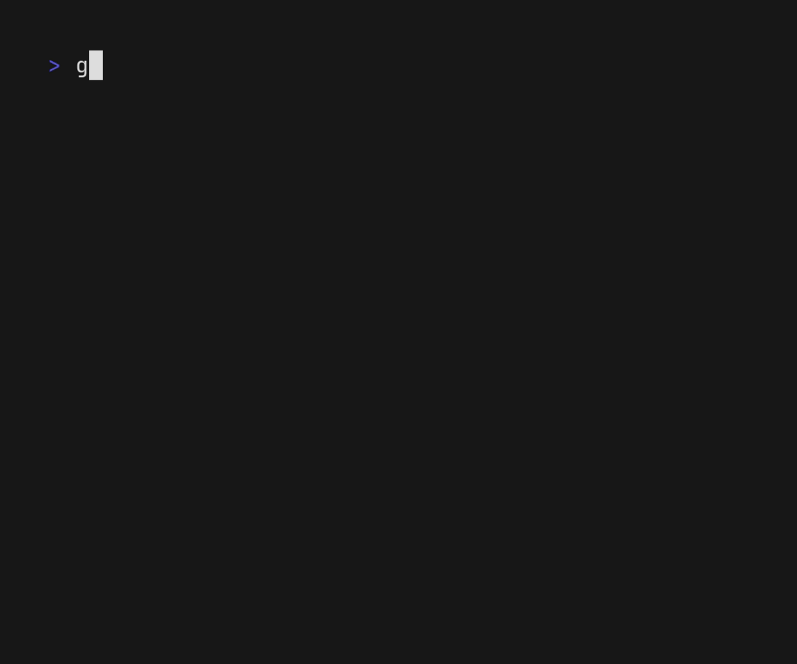
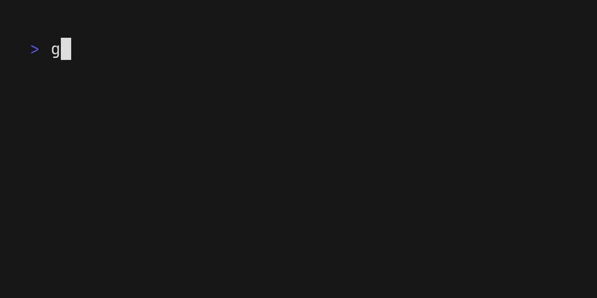

# Examples

[English](./#readme) | 日本語

- [基本](#基本)
- [複数選択](#複数選択)
- [事前選択](#事前選択)
- [大文字 / 小文字を区別する](#大文字--小文字を区別する)
- [キーマップ](#キーマップ)
- [ホットリロード](#ホットリロード)
- [見た目をカスタマイズする](#見た目をカスタマイズする)

## 基本

[Example](./basic/)

## 複数選択

[Example](./multiple/)

## 事前選択

[Example](./preselect/)

## 大文字 / 小文字を区別する

[Example](./case-sensitive/)

## キーマップ

[Example](./keymap/)

## ホットリロード

[Example](./hotreload/)

## 見た目をカスタマイズする

- [プロンプト](#プロンプト)
- [カーソル](#カーソル)
- [選択中 / 未選択アイテムの接頭辞](#選択中--未選択アイテムの接頭辞)
- [インプットの位置](#インプットの位置)
- [インプットのプレースホルダ](#インプットのプレースホルダ)
- [カウントビュー](#カウントビュー)
- [スタイル](#スタイル)

### プロンプト

[Example](./prompt/)

### カーソル

[Example](./cursor/)

### 選択中 / 未選択アイテムの接頭辞

[Example](./prefix/)

### インプットの位置

[Example](./input-position/)

### インプットのプレースホルダ

[Example](./placeholder/)

### カウントビュー

[Example](./countview/)

### スタイル

[Example](./styles/)

